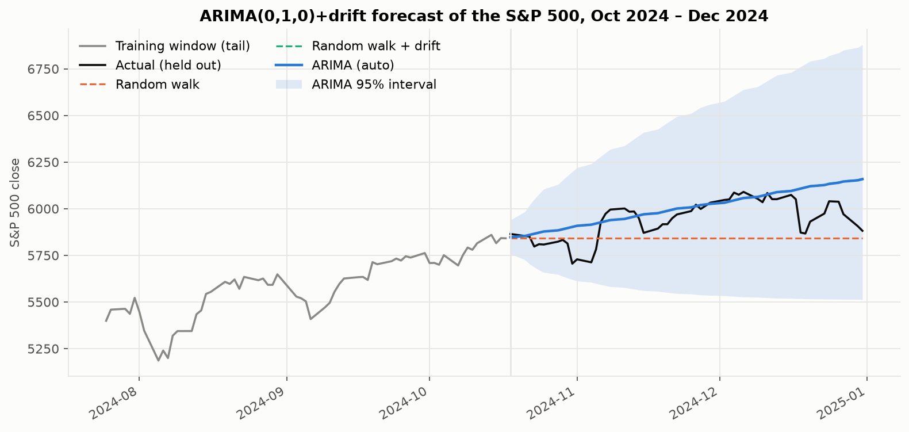
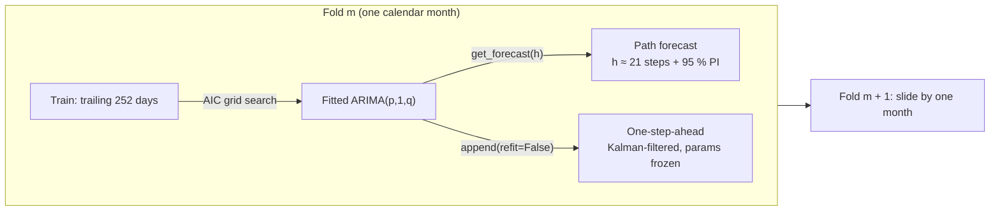

# S&P 500 ARIMA: does a textbook time-series model beat a random walk?

[](https://github.com/SomeGuy966/sp500_arima/actions/workflows/ci.yml)
[](pyproject.toml)
[](https://docs.astral.sh/ruff/)
[](pyproject.toml)
[](LICENSE)

A walk-forward evaluation of ARIMA forecasts on the S&P 500 over **600 consecutive months
(1975–2024)**, measured against the baselines that actually matter — a random walk and a
random walk with drift — with Diebold-Mariano tests, interval-calibration checks, and a
transaction-cost-aware trading backtest.

The short version: **an auto-selected ARIMA is statistically indistinguishable from a random
walk at a one-month horizon, and statistically *worse* at one day.** The daily signal has a
real but small gross edge that disappears at 5 bps of costs. That is the result the efficient
market hypothesis predicts, and the codebase is built to demonstrate it rigorously rather than
to hide it.

---

## Headline results

Every number below is out-of-sample: each month the models are re-fit on the trailing 252
trading days and asked to forecast the month ahead. Full tables are regenerated by
`make backtest` into [`reports/backtest_summary.md`](reports/backtest_summary.md).

**Path forecast (whole month ahead, 600 folds, 12 608 days)**

| Model | MAPE | RMSE (log, %) | Direction | 95 % PI coverage | DM vs random walk |
| --- | ---: | ---: | ---: | ---: | ---: |
| ARIMA (AIC-selected, p,q ≤ 3, ± drift) | 2.48 % | 3.53 | 54.9 % | 93.2 % | *p* = 0.93 |
| Random walk | 2.48 % | 3.52 | — | 93.4 % | — |
| Random walk + drift | 2.47 % | 3.56 | 58.0 % | 93.4 % | *p* = 0.37 |

**One-step-ahead forecast (daily, parameters frozen between monthly re-fits)**

| Model | MAPE | RMSE (log, %) | Direction | DM vs random walk |
| --- | ---: | ---: | ---: | ---: |
| ARIMA | 0.75 % | 1.11 | 53.2 % | *p* = 0.001 (ARIMA worse) |
| Random walk | 0.74 % | 1.10 | — | — |
| Random walk + drift | 0.73 % | 1.10 | 52.9 % | *p* = 0.15 |

**Trading the daily sign of the ARIMA forecast (long/short, decided at the prior close)**

| Cost per side | 0 bps | 1 bps | 2.5 bps | 5 bps | 10 bps |
| --- | ---: | ---: | ---: | ---: | ---: |
| ARIMA signal Sharpe | **0.70** | 0.60 | 0.46 | 0.21 | −0.27 |
| Buy & hold Sharpe | 0.60 | 0.60 | 0.60 | 0.60 | 0.60 |

Three things a reader should take away:

1. **The original 2.48 % monthly MAPE is exactly what "predict today's price" scores.** AIC
   picks the pure random walk `ARIMA(0,1,0)` in 44 % of months and a specification with
   p + q ≤ 1 in most of the rest. When it does add AR/MA terms, they do not help.
2. **At one day, estimation noise costs more than the AR/MA terms earn.** With 252
   observations of near-white-noise returns, the extra parameters are fitted to noise; the
   Diebold-Mariano test rejects equal accuracy in the random walk's favour (*t* = 3.2).
3. **The "edge" is real, era-dependent, and smaller than transaction costs.** Daily lag-1
   autocorrelation of the index was **+0.08** in 1975–89 (stale prices), **≈ 0** in
   1990–2004, and **−0.12** in 2005–24 (short-term reversal). The rolling ARIMA adapts to
   whichever regime it is in — gross Sharpe 1.03 and 0.70 in the first and last eras, 0.30
   in the middle — and never beats buy-and-hold after a 5 bps haircut.

| Era | Lag-1 autocorr | Direction | Sharpe gross | Sharpe net (5 bps) | Buy & hold |
| --- | ---: | ---: | ---: | ---: | ---: |
| 1975–1989 | +0.077 | 53.7 % | 1.03 | 0.41 | 0.78 |
| 1990–2004 | −0.001 | 51.8 % | 0.30 | −0.13 | 0.58 |
| 2005–2024 | −0.121 | 53.5 % | 0.70 | 0.27 | 0.51 |

---

## Figures

<p align="center">
  
</p>

*Forecast error tracks realised volatility (1987, 2008, 2020) identically for every model.
The bottom panel is the ARIMA − random-walk gap: it oscillates around zero and is never
persistently negative.*

<p align="center">
  
  
</p>

*Left: 95 % intervals cover only ~91 % of one-day-ahead outcomes — Gaussian intervals miss
the fat tails of daily returns — and converge toward nominal as horizons aggregate. Right:
the specifications AIC chooses on a rolling one-year window.*

<p align="center">
  
</p>

*Growth of $1 net of 5 bps per side. The ARIMA signal is flat whenever the selected model
is the random walk (no signal), shorts aggressively in 2008, and compounds at 2.1 % a year
against 9.3 % for buy-and-hold.*

<p align="center">
  
</p>

*A single fit on 2024 (80/20 split): the selected model is a random walk with drift, and the
95 % interval widens as √h. The random-walk-plus-drift baseline sits exactly under the ARIMA
line — they are the same model.*

---

## Methodology

### Data

Daily `^GSPC` closes from 1974-01-02 to 2024-12-31 (12 861 bars) ship in
[`data/sp500_daily.csv`](data/sp500_daily.csv) so every command runs offline and every result
is reproducible. `sp500-arima fetch` refreshes the snapshot from Yahoo Finance
(`pip install "sp500-arima[fetch]"`). Timestamps are normalised to timezone-naive dates,
and the loader rejects duplicates, gaps, and non-positive prices before anything is
log-transformed.

### Why log prices

Every model operates on `y_t = ln P_t`. An ARIMA(p, 1, q) on log prices is an ARMA(p, q)
on log returns — the natural stationary object — and forecasting in log space guarantees
positive price forecasts with correctly asymmetric prediction intervals once exponentiated.

`sp500-arima diagnose` runs ADF and KPSS on both log prices and log returns. The two tests
have opposite null hypotheses, so an unambiguous verdict needs both: prices are I(1)
(ADF fails to reject, KPSS rejects), returns are I(0) (ADF rejects, KPSS does not).

### Model and order selection

Order selection is a grid search over `p, q ∈ {0..3}` and `trend ∈ {none, drift}` scored by
AIC (or BIC via `--criterion bic`), implemented in ~40 lines of `statsmodels` with no
`pmdarima` dependency. For the small grids that are appropriate for daily returns, stepwise
search buys nothing. The drift term is `trend="t"` in the integrated model, which is the
correct way to express a random walk with drift in statsmodels (`"c"` is rejected for
`d > 0`).

### Baselines

Under weak-form market efficiency the best forecast of tomorrow's price is today's, so
[`baselines.py`](src/sp500_arima/baselines.py) implements:

| Baseline | Point forecast | Interval |
| --- | --- | --- |
| Random walk | `y_t` | `± z · σ · √h` |
| Random walk + drift | `y_t + h · mean(Δy)` | `± z · σ · √h` |

Both expose the same `fit / forecast / one_step_ahead` protocol as the ARIMA model, and a
unit test asserts that `ARIMA(0,1,0)` reproduces the naive forecaster to floating-point
precision.

### Evaluation protocol



Each month yields two kinds of strictly out-of-sample forecast:

* **Path** — the whole month from the last training day, with a prediction interval.
  This is what the original `accuracy.py` measured; the monthly MAPE is reproduced exactly.
* **One-step-ahead** — each day predicted from all data up to the previous close, with
  coefficients frozen at the monthly fit (`ARIMAResults.append(refit=False)` re-runs the
  Kalman filter without re-estimating). This is what a live system would have, and it is the
  input to the trading backtest.

Folds are independent processes (`ProcessPoolExecutor` with a per-worker initializer so the
price array is pickled once, not per fold). The full 600-fold run takes ~100 s on 10 cores.

### Metrics

All accuracy metrics are scale-free so that 1975 and 2024 contribute equally: MAPE, RMSE of
log errors, directional accuracy on returns (zero forecasts excluded, so the random walk is
"undefined" rather than a spurious 50 %), and empirical interval coverage.

Model comparisons use the **Diebold-Mariano test** with the Harvey-Leybourne-Newbold
small-sample correction ([`metrics.py`](src/sp500_arima/metrics.py)). For the path horizon
the test runs on the 600-month series of squared log errors (non-overlapping, `h = 1`); for
one-step forecasts it runs on the pooled daily errors.

### Trading backtest

Position for day *t* = sign of the forecast return from close *t−1* to close *t*, decided at
close *t−1* — no look-ahead by construction. Turnover is charged at a configurable cost per
unit, buy-and-hold is evaluated on the same days, and Sharpe uses a zero risk-free rate.
[`strategy.py`](src/sp500_arima/strategy.py) reports CAGR, volatility, Sharpe, max drawdown,
hit rate, turnover, time in market, a cost-sensitivity sweep, and an era breakdown.

---

## Quickstart

```bash
git clone https://github.com/SomeGuy966/sp500_arima.git
cd sp500_arima
pip install -e ".[dev]"          # or: poetry install --all-extras
```

```bash
sp500-arima diagnose                                  # ADF / KPSS / Ljung-Box on recent data
sp500-arima fit --start 2024-01-01 --end 2025-01-01   # one split, fan chart + residual plots
sp500-arima backtest --out reports                    # full 1975-2024 walk-forward (~2 min)
sp500-arima report --out reports                      # rebuild tables + figures from CSVs
```

Or simply `make check` (lint + types + tests) and `make backtest`.

### CLI reference

| Command | What it does | Key options |
| --- | --- | --- |
| `fetch` | Download a fresh OHLCV snapshot from Yahoo | `--ticker`, `--start`, `--out` |
| `diagnose` | ADF + KPSS on log prices and returns; Ljung-Box on returns | `--start`, `--end` |
| `fit` | Single train/test split: order selection, residual diagnostics, accuracy vs baselines, plots | `--split`, `--train-frac`, `--order 1,1,0`, `--trend`, `--criterion`, `-v` |
| `backtest` | Walk-forward evaluation over every month in range | `--window`, `--refit W/M/Q`, `--max-p/--max-q`, `--jobs`, `--cost-bps`, `--mode` |
| `report` | Re-render Markdown tables and figures from a saved backtest | `--out`, `--cost-bps`, `--mode long_flat` |

Every subcommand accepts `--data path/to/prices.csv` to run on any daily close series with
`Date` and `Close` columns.

### Library use

```python
import numpy as np
from sp500_arima import ArimaForecaster, BacktestConfig, ModelConfig, load_prices, run_backtest

if __name__ == "__main__":  # run_backtest parallelises with multiprocessing
    prices = load_prices()
    model = ArimaForecaster(ModelConfig(max_p=2, max_q=2)).fit(np.log(prices["2023":"2024"]))
    print(model.label, model.aic)

    result = run_backtest(prices, BacktestConfig(start="2015-01-01", end="2025-01-01"))
    print(result.summary()[["path_mape", "one_step_dm_p"]])
```

Calling `run_backtest` at module level without the guard fails fast with an explanatory
`RuntimeError` in each worker rather than hanging, and `n_jobs=1` never needs one.

---

## Project layout

```
src/sp500_arima/
├── data.py          load / validate / normalise prices, optional yfinance fetch
├── diagnostics.py   ADF, KPSS, Ljung-Box, automatic d selection
├── model.py         ArimaForecaster, ModelConfig, AIC/BIC grid search, Forecaster protocol
├── baselines.py     NaiveForecaster (random walk), DriftForecaster
├── metrics.py       MAPE / RMSE / MAE / direction / coverage / Diebold-Mariano
├── backtest.py      fold schedule, parallel walk-forward, BacktestResult + summary tables
├── strategy.py      signal → positions → net returns, Sharpe/DD, cost sweep, era breakdown
├── plotting.py      fan chart, rolling error, coverage, order counts, equity, residuals
├── report.py        Markdown rendering (no tabulate dependency)
└── cli.py           argparse front-end: fetch / diagnose / fit / backtest / report
tests/               59 tests, 95 % line coverage, synthetic AR(1) and random-walk fixtures
data/                bundled ^GSPC snapshot (644 KB)
reports/             generated summary + figures committed for the README
```

## Engineering notes

* **Correctness first.** Tests pin the things that are easy to get subtly wrong: no
  look-ahead in fold construction, `ARIMA(0,1,0) ≡ naive`, one-step predictions equal the
  path's first step, √h interval scaling, DM sign convention, turnover accounting, and
  sequential vs parallel backtests producing byte-identical output.
* **Typed end to end.** `mypy --strict` passes; models share a `Forecaster` protocol so the
  backtest is agnostic to what it is evaluating.
* **Reproducible.** Data snapshot in-repo, deterministic order selection, figures and the
  summary report regenerated by one command and committed alongside the code.
* **CI** runs Ruff, mypy, the test matrix on Python 3.11–3.13, and a two-year end-to-end
  smoke backtest whose report is uploaded as an artifact.

## Limitations and next steps

* Intervals are Gaussian and homoskedastic; a GARCH(1,1) error model would fix the ~91 %
  one-day coverage. `--refit W` already exists to test faster adaptation.
* The order search is exhaustive over a small grid; for larger grids a stepwise search or
  the `innovations_mle` estimator would be the next step.
* The strategy is deliberately naive (sign of forecast, unit position). A volatility-scaled
  position or a threshold on forecast magnitude (`StrategyConfig.threshold`) is the obvious
  extension, and the era breakdown suggests the signal should be conditioned on the regime.
* Exogenous regressors (VIX, term spread) via SARIMAX are a natural follow-up; the
  `Forecaster` protocol was designed so that adding one is a new class, not a refactor.

## License

MIT — see [LICENSE](LICENSE).
