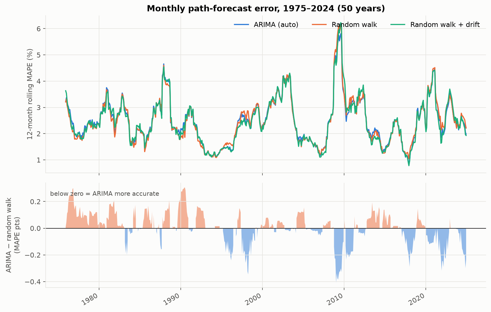
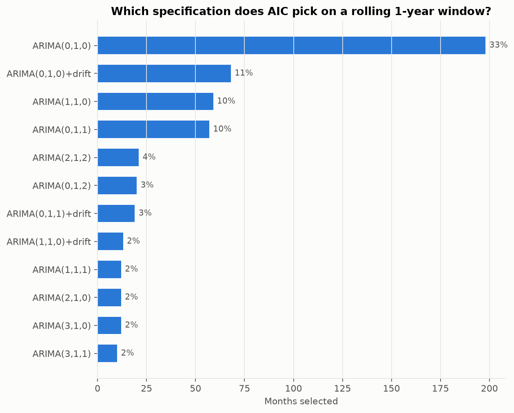
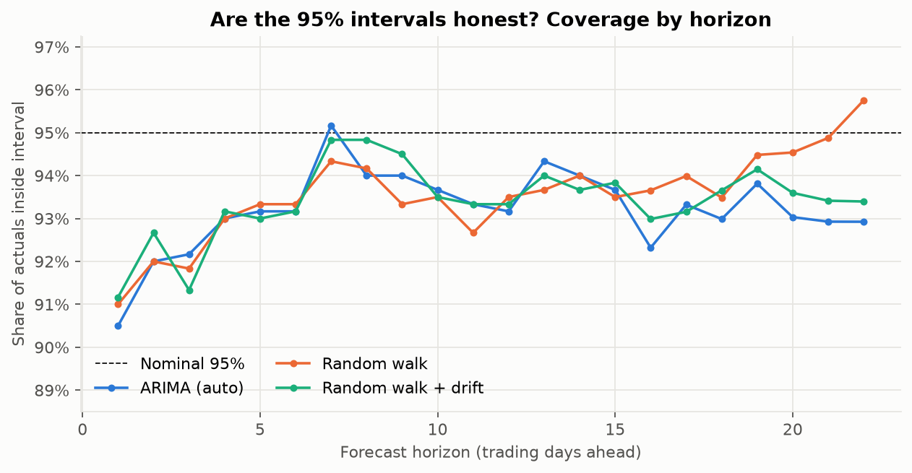
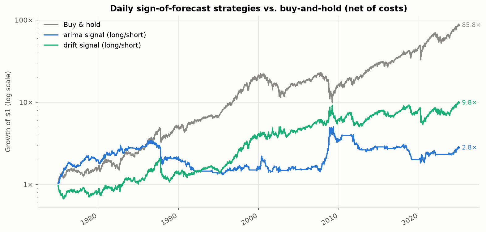
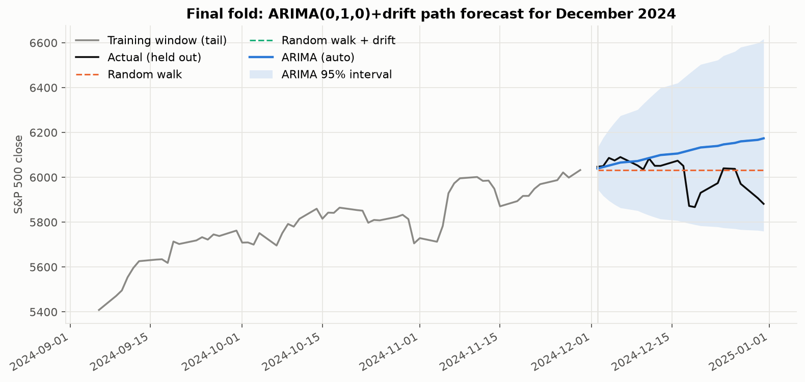

# Walk-forward backtest summary

Generated 2026-09-12 16:47 UTC · 600 monthly folds from 1975-01 to 2024-12 · 12608 trading days · 96s wall time

## Configuration

- Training window: **252 trading days**, re-fit every **M**
- Order search: p ≤ 3, q ≤ 3, d = 1, trend ∈ {n, t}, scored by **AIC**
- Prediction intervals at **95%**

## Path forecasts (whole month from the last training day)

| Model | MAPE % | Mean monthly MAPE % | RMSE % | Direction | 95% PI coverage | DM p vs RW |
| --- | ---: | ---: | ---: | ---: | ---: | ---: |
| ARIMA (auto) | 2.48 | 2.48 | 3.53 | 54.9% | 93.2% | 0.931 |
| Random walk | 2.48 | 2.48 | 3.52 | — | 93.4% | — |
| Random walk + drift | 2.47 | 2.47 | 3.56 | 58.0% | 93.4% | 0.373 |

*Direction* is the sign agreement between forecast and realised month-over-origin return. *DM p* is the two-sided Diebold-Mariano p-value against the driftless random walk on monthly squared log errors; small values mean the accuracy difference is unlikely to be noise.

## One-step-ahead forecasts (daily, parameters frozen between re-fits)

| Model | MAPE % | RMSE % | Direction | DM p vs RW |
| --- | ---: | ---: | ---: | ---: |
| ARIMA (auto) | 0.75 | 1.11 | 53.2% | 0.001 |
| Random walk | 0.74 | 1.10 | — | — |
| Random walk + drift | 0.73 | 1.10 | 52.9% | 0.152 |

The random walk forecasts a zero return, so its direction metric is undefined.

## Selected specifications

| Specification | folds | share |
| --- | ---: | ---: |
| ARIMA(0,1,0) | 198 | 33.0% |
| ARIMA(0,1,0)+drift | 68 | 11.3% |
| ARIMA(1,1,0) | 59 | 9.8% |
| ARIMA(0,1,1) | 57 | 9.5% |
| ARIMA(2,1,2) | 21 | 3.5% |
| ARIMA(0,1,2) | 20 | 3.3% |
| ARIMA(0,1,1)+drift | 19 | 3.2% |
| ARIMA(1,1,0)+drift | 13 | 2.2% |
| ARIMA(1,1,1) | 12 | 2.0% |
| ARIMA(2,1,0) | 12 | 2.0% |

## Trading the one-step signal

Position = sign of the one-step forecast return (long/short), decided at the prior close, charged 5 bps per unit turnover. Buy-and-hold is evaluated on the same days. Sharpe uses a zero risk-free rate.

| Strategy | CAGR | Vol | Sharpe | Max DD | Hit rate | Turnover/day | Time in mkt |
| --- | ---: | ---: | ---: | ---: | ---: | ---: | ---: |
| Buy & hold | 9.3% | 17.3% | 0.60 | -56.8% | 53.3% | 0.00 | 100% |
| arima signal (long/short) | 2.1% | 14.3% | 0.21 | -63.7% | 50.9% | 0.55 | 67% |
| drift signal (long/short) | 4.7% | 17.3% | 0.35 | -48.5% | 52.8% | 0.01 | 100% |

### Sensitivity to transaction costs

| Sharpe by cost | 0 bps | 1 bps | 2.5 bps | 5 bps | 10 bps |
| --- | ---: | ---: | ---: | ---: | ---: |
| Buy & hold | 0.60 | 0.60 | 0.60 | 0.60 | 0.60 |
| arima signal (long/short) | 0.70 | 0.60 | 0.46 | 0.21 | -0.27 |
| drift signal (long/short) | 0.36 | 0.35 | 0.35 | 0.35 | 0.34 |

### By era

Lag-1 autocorrelation of daily log returns is the structure a low-order ARIMA exploits; gross Sharpe is before costs, net is after.

| Era | Days | Lag-1 autocorr | Direction | Sharpe (gross) | Sharpe (net) | Sharpe (buy & hold) |
| --- | ---: | ---: | ---: | ---: | ---: | ---: |
| 1975–1989 | 3791 | +0.077 | 53.7% | 1.03 | 0.41 | 0.78 |
| 1990–2004 | 3784 | -0.001 | 51.8% | 0.30 | -0.13 | 0.58 |
| 2005–2024 | 5033 | -0.121 | 53.5% | 0.70 | 0.27 | 0.51 |

## Figures

